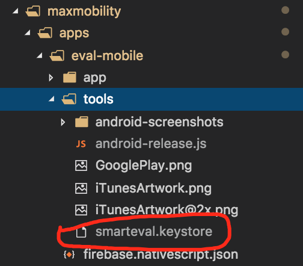

# Permobil-Client

This repo contains multiple app projects.
Mobile apps are built using NativeScript + Angular.
Wear OS apps are built using plain NativeScript to avoid having additional javascript loaded with a framework like Angular.

## Setup

Execute `npm run setup.all`

## Running the Smart Evaluation Mobile app

Execute - `npm run se.a` for Android.
Execute - `npm run se.i` for iOS.

- _This should path down to the `apps/mobile/smart-eval` directory and exec the `tns run android --env.aot` cmd to start the Smart Eval app._

## Running the Pushtracker Mobile app

Execute - `npm run pt.m.a` for Android.
Execute - `npm run pt.m.i` for iOS.

- _This should path down to the `apps/mobile/pushtracker` directory and exec the `tns run android --env.aot` cmd to start the PushTracker mobile app._

## Running the Pushtracker Wear OS App

Execute - `npm run pt.w.a` for Android.

- _This should path down to the `apps/wear/pushtracker` directory and exec the `tns run android` cmd to start the PushTracker WearOS app._

## Running the SmartDrive Wear OS App

Execute - `npm run sd.w.a` for Android.

- _This should path down to the `apps/wear/smartdrive` directory and exec the `tns run android` cmd to start the SmartDrive WearOS app._

### SmartDrive Wear WatchFaces

The SmartDrive Wear OS App contains watchface(s) that are packaged with the app so they're available to the user when the SD.W app is installed on a WearOS device.

WearOS watchfaces are services and in order to bundle it with the WearOS app, we've put the source inside `apps/wear/smartdrive/app/App_Resources/Android/src/`.

#### Developing the WatchFace

1. You can modify the Java files directly in the directory using any IDE (not recommended).
2. Build/Run the SD.W app using the `npm run sd.w.a` script in the root of the repo.
    - Once the project is built, the CLI will provide the `platforms/android` directory inside the `apps/wear/smartdrive/` directory. This is a native Android project that can be opened with Android Studio.
    - Open Android Studio, then select this directory as the "existing Android Studio project".
    - Any changes you make during development here will need to be copied back to the actual source files in `apps/wear/smartdrive/app/App_Resources/Android/src/`.
    - However, you could link the native project `src/main` directory back to the `apps/wear/smartdrive/app/App_Resources/Android/src/` and git should monitor file changes making it easier to push changes to the actual source files to the repo.

## Release Builds for publishing Smart Evaluation (smart-eval-app)

#### Android

**Important Android Release Note**: The release .keystore file, this is kept internally so only Permobil can publish. Without it, you cannot create a signed release build.
For the build to work successfully, the script will look for the keystore in the `apps/mobile/smart-eval/tools/` directory. Image below shows where it should be for the script to work properly.

- Execute `npm run se.android.release $KEYSTORE_PASSWORD` - replace \$KEYSTORE_PASSWORD with the actual password for the keystore for smart-eval-app). If you do not provide the password argument in the command, you'll be prompted for it.

#### iOS

- Execute `npm run se.ios.release` - this will create a release build for iOS.
- Open the .xcworkspace file in xcode, the file is located in `apps/mobile/smart-eval/platforms/ios`
- Make sure the build # has been incremented or the upload will fail if it's already used.
- Create an archive and then upload to iTunesConnect via XCode.
